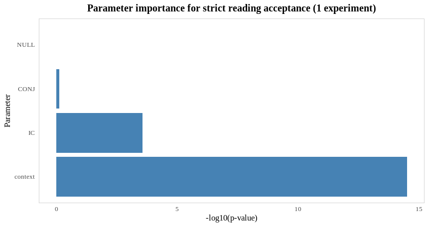
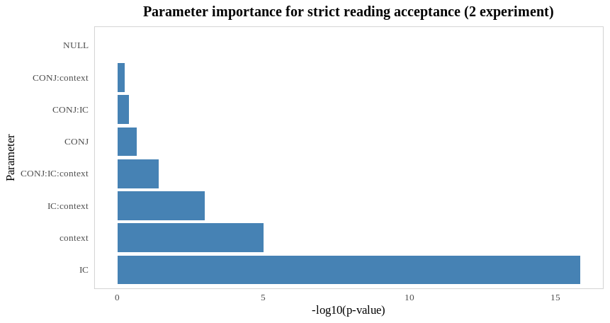

# 1. Introduction

In the field of research on pronouns in formal syntax, researchers have always been strongly attracted to the case of strict/sloppy identity ambiguity in VP ellipsis. To demonstrate this phenomenon, consider sentence (1):

(1) *John likes his suit, and Bill does too.*

Following Kitagawa (1991), Fiengo and May (1994), the strict/sloppy ambiguity arises because a pronoun can either be reconstructed in the ellipsis site with original index or with a changed index, giving the (1) two readings:

(2) *John$_j$, likes his$_j$ suit, and Bill$_b$ does [$_{VP}$ like his$_j$, suit] too.*  
(3) *John$_j$, likes his$_j$ suit, and Bill$_b$ does [$_{VP}$ like his$_b$, suit] too.*

If a pronoun is reconstructed with its original index, then the reading is strict, and the change of an index indicates a sloppy reading.

Ross (1967) was one of the first to draw attention to this ambiguity, and he was the one to construct a term "sloppiness", describing such inconsistency.

To illustrate this phenomenon with reflexives, consider following example:

(4) *John corrected himself, before Bill did [e].*

In this example, the strict reading will be if [$_{VP}$ corrected himself (=John)] is restored at the place of the gap, and the sloppy reading if it is restored as [$_{VP}$ corrected himself (=Bill)] accordingly.

Many attempts have been made to explain the availability of both readings (see Fiengo and May, 1994, Tomioka, 1999, Fox, 2000, Hestvik, 1998, Kehler, 2000, 2002, Ong & Brasoveanu, 2013, Charnavel & Sportiche, 2021 and many others). Despite the fact that quite a lot of research has been conducted on what influences the choice of sloppy and strict reading, no unambiguous solution has yet been found when one identity choice prevails over another for the speaker.

The purpose of this paper is to extend the existing research for identity resolution of reflexives in the Russian language, and understand which of the types of theories presented in a literature review is applicable to Russian. And, overall, explain why the language processing favors one analysis over another. The current study is aimed to address this issue, and it is guided by the following research questions:

1. In what cases is it possible in the Russian language to have a strict reading for the reflexive inside a VP ellipsis?
2. What are the parameters responsible for each identity resolution? And if there are several such conditions, which ones affect the choice of identity more?
3. What is the best theory that could account for the choice of strict reading for Russian?

# 2. Literature Review

In terms of reflexives, it was long believed that reflexives can only give rise to a sloppy reading (Williams 1977, Chomsky 1981, Reinhart 1983), because in the standard Binding Theory, reflexives can only be interpreted as bound variables. Although the locality constraints on reflexives still remain controversial (Reuland 2011).
Despite this, in earlier literature, in Sag (1976), there is an example in which a strict reading of a reflexive, though not in an ellipsis site, is possible:

(5) *Betsy couldn't imagine herself dating Bernie, but Sandy could.*  
   *= but Sandy could imagine Betsy dating Bernie.*

Although later studies that sometimes allowed strict reading for reflexives (Kitagawa 1991) or explaining it by the verb's lexical properties (Dalrymple 1991) had emerged.

The observed asymmetry in the availability of interpretations is explained in different ways by different existing theories. In this paper, I will consider some of such frameworks.

First one is from Hestvik (1995) and is purely syntactic. Hestvik (1995) explains the presence/absence of a strict reading by the structure of the sentence, namely the nature of the connection between its clauses: if clauses are in a parallel or coordination relationship, then the strict reading will be unavailable, but if they are in subordination, then the chance of a strict reading of the reflexive increases significantly.
Hestvik observes that if we simply restore a VP containing a reflexive in an ellipsis site, a strict reading will violate principle A of the Binding Theory. However, this can be solved by postulating the raising of a reflexive out of the VP at the LF (as in the same case when quantors can have a wide scope via Quantor Raising, for more explanation see May (1985)).
The availability for both readings of the same linguistic material thus is explained by the order in which these operations (copying of the VP and raising of the reflexive) are applied. The movement of the reflexive would create a λ-abstraction configuration leading to a bound variable interpretation. Consider the following examples:

(6) *John [$_{VP}$ corrected himself] before Bill e.*  
    *John [$_{VP}$ corrected himself] before Bill [$_{VP}$ corrected himself].*  
    *John [$_{a}$ himself$_i$ [$_{VP}$ corrected t$_i$] before Bill [$_{a}$ himself$_j$ [$_{VP}$ corrected t$_j$].*  
    (the derivation process of a sloppy reading)

(7) *John [$_{VP}$ corrected himself] before Bill e].*  
    *John [$_{a}$ himself$_i$ [$_{VP}$ corrected t$_i$] before Bill e]].*  
    *John [$_{a}$ himself$_i$ [$_{VP}$ corrected t$_i$] before Bill [$_{VP}$ corrected t$_i$]].*  
    (the derivation process of a strict reading)

In (6), the VP is copied first, and then the reflexive is raised, so the trace inside the elided VP is controlled inside its clause, thus a sloppy reading is obtained. If the order of operations is reversed, we get a strict reading – both the trace in the source VP and the trace in the elided VP have the same antecedent in the main clause. However, in his research, Hestvik did not take into account many cases when strict reading is available even when coordinate connective is used in a sentence, for example, if the source clause is negated, or in some cases when the strict reading emerges influenced by the semantics of the verb.

Kehler (2000, 2002) provides another explanation based on the discourse Causality Effect factor. There are three main types of discourse relationships, such as Resemblance, Cause Effect, and Occasion, each with different subtypes, for instance:

(8) *Bill likes to play golf. Al likes surfing the net.* (Resemblance: Parallelism)

(9) *Bill called his lawyer, because he was about to be impeached.* (Cause-Effect: Explanation) [Ong, M., Brasoveanu, A., 2013: 255]

A Resemblance relationship between clauses requires a one-to-one correspondence between the set of entities mentioned in them, as well as some salient property relation that is present in both sets. A Cause-Effect relationship requires only an implicational relationship between clauses (or sentences, accordingly). A Resemblance relationship is built on comparing two sentences and emphasizing parallelism, and requires the agreement of syntactic arguments between the two sentences, therefore one can expect for it to be sensitive to syntactic identity and the condition A of the Binding Theory. However, establishing a Cause-Effect relationship requires only the correlation of the propositional meanings of two sentences (Kim & Runner 2009). Compare the examples from Kitagawa (1991):

(10) a. \**This problem was looked into by John, and Bill did too.*  
    b. \**John$_i$, blamed himself$_i$, and Bill did too [blame x$_i$].*  
    – Resemblance relationship

(11) a. ?*This problem was looked into by John, even though Bill already had.*  
    b. *John, blamed himself$_i$, because Bill did [blame x$_i$].*  
    – Cause-Effect relationship

In the (11) the acceptability of strict reading increases because of the Cause-Effect relationship between the two clauses.

Ong and Brasoveanu (2013) in their study emphasize that in addition to the syntactic or discursive aspect, the choice of reflexive identity is influenced by the lexical component of the verb. In their research, they conduct various experiments, adding to the already existing theories that implicit causality (IC) biases inherent in different verbs (Garvey and Caramazza 1974, McKoon et al. 1993, Rohde 2008) can influence the resolution of a reflexive pronoun either as a semantical object or subject of the verb. As in the following example from Ong and Brasoveanu (2013: 255):

(12) *John disappointed Bill because he (=John) stole the book.* (IC1 type of the verb)  
(13) *John scolded Bill because he (=Bill) stole the book.* (IC2 type of the verb)

In (12) the semantics of the verb of IC1 type influence the pronoun to have a subject meaning, and for the (13) example with the verb of IC2 type the opposite is true. It is expected to have the same effect with reflexives in an ellipsis. Consider the sentences from Ong, M., Brasoveanu, A. (2013: 255), that illustrate that:

(14) *If John disgraced himself, Bill did too.* (IC1 type – sloppy reading preference)  
(15) *If John criticized himself, Bill did too.* (IC2 type– strict reading preference)

It was statistically confirmed that speakers are more likely to choose a strict reading if the IC2 verbs are used in a sentence, regardless of the type of a connective that is used in a sentence.

To summarize, for more than 30 years, a large number of theories have been proposed in order to explain the availability of strict or sloppy reading of reflexives in VP ellipsis in English. Unfortunately, there has not been enough research on this topic in Russian. In this article, I will provide experimental research based on experiments from Ong and Brasoveanu (2013) in order to understand which of the proposed solutions work for the Russian language, and whether it is possible to somehow expand these explanations from English:

1. It is assumed that *sebya* would behave the same way as *oneself* in English in case of using the IC1 type verbs, because in Russian *sebya* performs the same function as reflexive postfix *-sya* – they both are often used to "reflexivize" verbs, yielding the sloppy reading. And, accordingly, it is expected to see a greater availability of the strict reading with the IC2 verbs.
2. Since Ong & Brasoveanu (2013) did not consider possessive reflexives in their study, it was decided to check whether their hypothesis works on the materials of Russian possessive reflexives. Since they cannot perform a "de-transitivizing" function, the IC should not affect the accessibility of the strict reading.
3. However, the availability of the strict reading should be influenced by the fact that the possessive reflexives are not co-argument with the subject, which means that semantically they should be more distinct, thus increasing the availability of strict reading.
4. Also, the hypothesis is that not only Implicit Causality can enhance the salience of an object, but also other factors.

# 3. The experimental studies

## 3.1 Experiment design

The experiments were based on experiments from Ong and Brasoveanu (2013). However, it was decided not to test the different types of if-then conditionals (different by early vs. late connective type manipulations), because in the original experiment these relations did not show any statistical significance. The results of this experiment proved to be much more interesting when instead of the if-then relationship the IC verb type was added to the Latin square.
Initially, it was planned to make items from combinations of three sentence coordinator types (subordinate, connective and conditional) and three different implicit causality types of verbs (IC1, IC2, NON-IC). For each combination, 4 different sentences were given, so the questionnaire consisted of 4 items with 9 stimuli each. Let us look at an example of one item:

Table: The example of 1 experimental item.

| type of coordinator | IC1 | IC2 | NONIC |
|---------------------|---------------------|---------------------|---------------------|
| conjunctive (and) | *Ljuba vdohnovila sebja na novye svershenija, i Vika tozhe.* | *Ljuba vinit sebja v proizoshedshem, i Vika tozhe.* | *Ljuba razreshila sebe poest' morozhenogo, i Vika tozhe.* |
| conditional (if) | *Esli Ljuba vdohnovila sebja na novye svershenija, to Vika tozhe.* | *Esli Ljuba vinit sebja v proizoshedshem, to Vika tozhe.* | *Esli Ljuba razreshila sebe poest' morozhenogo, to Vika tozhe.* |
| subordinate (so) | *Ljuba vdohnovila sebja na novye svershenija, poetomu Vika tozhe.* | *Ljuba vinit sebja v proizoshedshem, poetomu Vika tozhe.* | *Ljuba razreshila sebe poest' morozhenogo, poetomu Vika tozhe.* |

Each stimulus sentence was preceded by a neutral context that gave general information about the described situation.

Most experimental studies of sloppy/strict ambiguity provide the respondent with a choice between a strict or sloppy reading in a single question, each represented by using the reconstructed ellipsis material. However, such design does not take into account the possibility of the respondent approving both readings at the same time. It was decided to divide the questions into each reading in order to eliminate the bias that arises when adding the answer "both readings are possible" to the list of answer options. The answer to the question about the possibility of a particular reading was "yes" or "no". Thus, the question item of the study in the questionnaire looked like this:

**context**: U Ljuby i Viki byla podruga Alena, no Lyuba s Alenoj porugalis', i Alena percehala.  
*(Lyuba and Vika had a friend, Alyona, but Lyuba and Alyona had a fight, and Alyona moved out.)*

**stimulus**: Lyuba vinit sebja v proizoshedshem, i Vika tozhe.  
*(Lyuba blames herself for what happened, and so does Vika.)*

*Vy ponimaete jeto predlozhenie kak: (You understand this sentence as:)*

**strict reading**: ... Vika vinit Lyubu v proizoshedshem. *(Vika blames Lyuba for what happened.)*  
☐ *da (yes)*  
☐ *net (no)*

**sloppy reading**: ... Vika vinit sebja v proizoshedshem. *(Vika blames herself for what happened.)*  
☐ *da (yes)*  
☐ *net (no)*

Initially, it was planned to give examples only with a neutral context, but during the interviewing of the respondents who completed the surveys, the following problems were revealed:

- even if there is no context given, or the context is neutral, we can not control whether or not the consultants make up their own additional context, and what kind of context they make up;
- problems using contexts that could cause a strict or sloppy reading, e.g.:

(16) **context**: 'Petya and Vanya are students and often participate in projects together. Petya was very lazy this time. Their programming project was rated "satisfactory"'.  
**stimulus**: V etot raz Petya kritikuet sebya, i Vanya tozhe.  
'This time, Petya criticizes himself, and Vanya does too.'

The example of the context given above causes strict reading to be more preferred: if Petya is the reason behind their low grade, and he criticizes himself, then Vanya will most likely too criticize him too, and pragmatics of the sentence make the reading 'Vanya criticizes Petya too'.

This way, the following hypothesis was put forward: the presence of a particular reading can be strongly influenced by context bias.
In order to test the effect of context on reading, it was decided to give the same stimuli, but with context bias towards strict reading to other participants in the study and compare the results. It was decided to give one group of respondents sentences with neutral context (control group), and the other with a bias for a strict reading (experimental group).

In order for our target variables to not be affected by the parameter of various connotations that can be influenced by context, a context with a strict reading bias for all sentences with target variables was chosen. Thus, by fixing this context variable on a certain reading and making it a constant, it will be possible to control the influence of the context, e.g. (16). By alternating the context that way, the anaphor in ellipsis site is most likely to have the same resolution as the antecedent, as in (23): Petya is most likely at fault for the grade that the boys had received, so the context increases the possibility of a strict reading *Vanya criticizes Petya too*.

Furthermore, if there is a ban on the presence of a strict reading, even when such mended context is being taken into account, then this can be counted as an absolute prohibition for the strict reading. Undoubtedly, it can be speculated that a presence of such specially mended context reduces the likelihood of sloppy reading, or in some other way affects the respondents' answers, however, it is unknown how the lack of context affects the informants' thought process, as it may be possible that the informants come up with a context more suitable for their chosen answers themselves. Nevertheless, in some sentences in order to slightly mitigate the influence of a sentence hinting at a certain reading, a neutral sentence between this sentence and the stimulus was implemented – a semantic bundle that serves as a kind of distraction. To summarize, this condition was selected and implemented to avoid variability in understanding the situation described in the stimulus.

Of the other problems that were encountered during the preparation for this study: not all IC verbs that were used in the researches on English material are possible to use in research on Russian, since some verbs from various IC groups from McKoon (1993) correspond to reflexive verbs that do not combine with the reflexive *sebya* ('self'). For example, completely standard expressions with transitive verbs in English, such as *disappointed himself, surprised himself, doubted himself*, in Russian are expressed by the corresponding reflexive verbs *razocharovalsya, udivisya, somnevalsya*. Sometimes such verbs did not allow the use of the reflexive at all, sometimes they did, but only in certain contexts.
In addition, there is a certain category of verbs that are used with the reflexive *sebya*, and at the same time do not allow for a strict reading due to the semantics of the verb, which denotes an action that can only be directed at one's self, or an action that can only be felt by one's self: *chuvstvovat'* ('feel'), *vesti* ('behave'), *lomat'* ('break'), *zastudit'* ('chill') and others.

Another problem was that implicit causality is in itself a topic worthy of separate study. Although the problem of implicit causality has been known for quite a long time and is used for many phenomena as a diagnosis, it is worth noting that it is still not fully understood which verbs exactly belong to certain IC groups in different languages. Many studies show slight differences in the lists of verb groups (Ferstl et.al. 2011, Yi 2019, Frederiksen & Mayberry 2021). NON-IC verbs are in a particular grey zone. But despite the small differences, there is a reason to believe that IC verbs that make up the semantic core of each group are universal for all languages (Hartshorne et.al. 2013).
In order to check whether the verb belongs to one or another implicit causality group in Russian, the fillers of the study were made in the form of a pronoun resolution test:

(17) *Ljuba golosovala za Katju v oprose, potomu chto ona oizyvchivyj chelovek.*  
'Lyuba voted for Katya in the poll because she is a sympathetic person.'

In the sentence (24), the pronoun *she* can be resolved either as Katya being a sympathetic person, or that such person is Lyuba. This verb was attributed to the non-implicit causality group, which was also later confirmed by the test results. A similar procedure was performed for all remaining verbs. The final list of verbs was formed based on lists in McKoon (1993). Implicit causality groups included in the study were as follows:

- **IC1**: inspire, humiliate, convince, entertain, deceive, calm, confuse, shock
- **IC2**: criticize, pity, respect, blame, doubt, praise, hate, help
- **NON-IC**: vote, draw, spot, allow, teach, hit, remind, wash

It is suggested that it is desirable to check the type of implicit causality of verbs for the languages with no definitive studies on that matter.
The first experiment was different from the second one in the type of reflexive that was used. In the first experiment, sentences with the reflexive pronoun *sebya* (oneself) were checked, in the second experiment possessive reflexive *svoj* (one's own) was checked.

## 3.2 Participants

52 respondents completed the first experiment, 42 completed the second experiment, with a 1:1 ratio of the control and experimental groups. For the 1 experiment a total of 3744 observations were collected, 3024 – for the 2 experiment. The respondents' age varied from 18 to 65 years old. All participants are native speakers of Russian.

The questionnaire included 36 stimuli, 24 fillers for checking the IC-causality of the verbs chosen and 7 fillers for checking respondents' attention. The experiment was conducted using Google Forms questionnaires, if it was a stimuli question, the respondent was shown one sentence along with the context and questions on the strict and sloppy reading, to which the respondent had to answer either "yes" or "no". The stimuli were mixed with fillers in a random order. The final calculations were performed according to each answer from the respondent: in one answer, "yes" or "no", fixed variables were encoded: the type of clause coordinator, the IC type of verb, the presence of context in the sentence, as well as the respondent's ID. Thus, calculations and statistics were made based on individual responses from respondents[^1].

[^1]: See Appendix A for the example of the data.

## 3.3 Model

Binary logistic regression was chosen as the model, rather than mixed-effects model, since we are interested in the probability of the influence of various effects on the binary distribution of the strict or sloppy readings (yes/no questions on individual readings from the design of the experiment). The results were computed via R script. The consultant's acceptability of a certain reading was a dependent variable (*answer*), and coordinator type (*conj*), IC verb type (*ic*), Cause-Effect relations (*cause_effect*) and the presence of bias in a context were fixed effects. The speaker's id (*speaker_id*) was added as the random effect variable. The selection of fixed effects and variables was performed manually based on the Akaike information criterion and the Bayesian information criterion. For computing which variable has an impact on the availability of different readings the following 2 formulas were attested:

1. `answer ~ conj * ic * context * cause_effect + (1 | speaker_id)`
2. `answer ~ conj + ic + context + cause_effect + (1 | speaker_id)`

We chose between models with factor interaction and without factor interaction, a likelihood ratio test was performed using the `anova()` function, according to the test results for the first experiment there is no statistically significant improvement when adding factor interaction, and as a result, the second model was chosen, because if there is no statistically significant factor interaction, there is no point in overcomplicating the model. However, for the second experiment, it was the reverse, as the factor interaction proved to be significant by the Likelihood Ratio Test (LRT). Additionally, the data was also labeled by Cause-Effect relations from Kim and Runner (2009).

In Kim and Runner (2009), Cause-Effect showed a significantly higher tendency (>70%) towards strict reading, while Resemblance showed a lower tendency. However, for neither of these experiments, as well as in Ong and Brasoveanu (2013), Cause-Effect relations did not show a statistically significant result. For the same reason this parameter is absent in the model formulas:

3. `answer ~ conj * ic * context + (1 | speaker_id)`
4. `answer ~ conj + ic + context + (1 | speaker_id)`

# 4. Experiments results

In general, there was a higher percentage of strict readings with the pronominal reflexives, than with the possessive reflexives. And, of course, the expected result was that there is always significantly more sloppy readings than strict readings.

{ width=50% height=200px }
{ width=50% height=200px }

{ width=50% height=200px }
{ width=50% height=200px }

## 4.1. 1 experiment

The results of Experiment 1 almost completely replicate those of Ong and Brasoveanu (2013).

Using the Simultaneous Evaluation with a Type III ANOVA the following results were obtained:

- the *if* type of coordinator (β$_i$$_f$=0.301, SE=0.154, p-value=0.01) and IC2 type of verb (β$_I$$_C$$_2$=0.354, SE=0.146, p-value=0.01) slightly decreased the availability of sloppy readings, while the *so* type of coordinator (β$_S$$_O$=0.618, SE=0.147, p-value<0.001) decreased the probability of the sloppy reading significantly and the absence of context bias (β$_N$$_O$$_B$$_I$$_A$$_S$=1.290, SE=0.129, p-value<0.001) was extremely significant for the presence of the sloppy reading;
- within each parameter, the presence of IC2 verb type (β$_I$$_C$$_2$=0.556, SE=0.135, p-value<0.001) increased the percentage of strict readings, and the absence of context bias (β$_N$$_O$$_B$$_I$$_A$$_S$=0.860, SE=0.111, p-value<0.001) had the most influence on the availability of a strict reading, therefore supporting the claims that the IC2 verb type and the presence of context bias influence the choice of the strict reading.

{ width=50% height=250px }
{ width=50% height=250px }

- the IC verb type (χ²=17.299, df=2, p-value<0.001) and the presence of a context bias (χ²=62.182, df=1, p-value<0.001) turned out to be significant for the strict reading;
- the type of coordinator(χ²=18.185, df=2, p-value<0.001), the IC type of verb (χ²=6.472, df=2, p-value=0.01) and the context bias (χ²=112.134, df=1, p-value<0.001) were all significant for the presence of a sloppy reading, with context bias as the most significant parameter.

{ width=50% height=250px }
{ width=50% height=250px }

Traditionally, reflexive pronouns have 2 possible interpretations: the 'de-transitivizer' interpretation and pronominal interpretation (that can also be viewed as an indexical). IC1 verbs increase the likelihood of strict reading because of their semantic nature. Let us compare the verbs of 2 groups: in the first, the syntactical subject of the sentence is also a semantic one, and in the second, the object is the semantic subject. Russian IC1 verbs especially get "de-transitivized" with reflexives, because in Russian *sebya* sometimes performs the same function as reflexive postfix *-sya* – they both are often used as operators on verbs: reflexivization turns a 2-place predicate into a 1-place predicate by identifying two of its arguments as identical, thus "de-transitivizing" the verb, and yielding the sloppy reading. One can speculate that such an observation might be true for many languages, since in a lot of languages reflexive inflections originate from reflexive pronouns (Charnavel and Sportiche 2022).

If the verb has a strong connotation that the center or a causee of an action is a subject, and the object of the verb serves only as a function of 'de-transitivization', then the speaker's attention will be focused on the subject entity, this way provoking the sloppy reading. Consider pair of sentences:

(18) *Vitya shokiru-et sebya, i Vanya tozhe [e].*  
    Vitya shock-PRS.3SG self.ACC and Vanya too [e].  
    Vitya will shock himself, and Vanya will [e] too.

(19) *Vitya pohval-it sebya, i Vanya tozhe [e].*  
    Vitya praise-PRS.3SG self.ACC and Vanya too [e].
    Vitya will praise himself, and Vanya will [e] too.

In (18) the possibility of the strict reading 'Vanya will shock Vitya', is significantly lower than in the possibility of strict reading 'Vanya will praise Vitya' in (19).

Given the propensity of speakers to resort to sloppy reading, as well as the fact that the 'default' function of reflexives is 'de-transivization', one can expect that if the verb of IC1 type is in the antecedent clause, then the remainder of the sentence will be resolved through sloppy reading. Then, if there is a presence of a verb and of IC2 type, the object of the verb becomes more semantically expressed and more prominent, the likelihood of reflexive resolution through the pronominal becomes higher, which means the likelihood of retrieving the strict reading is higher.

However, the most interesting fact is that despite the fact that both parameters - implicit causality of the verb and context bias increase the likelihood of strict readings, the context bias had a stronger effect on the choice of a reading, than the IC type of a verb.

## 4.2. 2 experiment

This time, for the presence of the sloppy reading only the absence of context bias (β$_N$$_O$$_B$$_I$$_A$$_S$ = 1.596, SE = 0.460, p-value < 0.001) was extremely significant. For the presence of the strict reading the statistically significant effect was also the absence of neutral context (β$_N$$_O$$_B$$_I$$_A$$_S$ = 1.073, SE = 0.370, p-value = 0.001). As for the interaction terms, most interaction terms involving CONJ and IC weren't significant, except for IC_non:context_no_bias, which is statistically significant (β$_I$$_C$$_n$$_o$$_n$$_:$$_c$$_o$$_n$$_t$$_e$$_x$$_t$$_n$$_o$$_b$$_i$$_a$$_s$ = 1.138, SE = 0.516, p-value = 0.01), and one three-way interaction shows weak trends toward significance: CONJ_if:IC_non:context_no_bias (β$_C$$_O$$_N$$_J$$_i$$_f$$_:$$_I$$_C$$_n$$_o$$_n$$_:$$_c$$_o$$_n$$_t$$_e$$_x$$_t$$_n$$_o$$_b$$_i$$_a$$_s$ = 1.753, SE = 0.724, p-value = 0.01).

{ width=50% height=250px }
{ width=50% height=250px }

The choice of the strict reading was most influenced by IC (χ² = 13.682, df = 2, p-value = 0.001) and the context bias (χ² = 8.942, df = 1, p-value = 0.001), and for the sloppy reading the context type was the most important parameter (χ² = 14.325, df = 1, p-value < 0.001).

{ width=50% height=250px }
{ width=50% height=250px }

The results for the second experiment were rather sloppy, but still as expected. For some reason, the influence of context on the strict reading was less significant than the IC type of the verb, which again still increased the probability of a strict reading.

Although, one can argue that this is a somewhat unexpected result, because in Russian possessive reflexives do not coincide in form with pronominal reflexives, and rather act as an index role for the nouns they define. That is, these reflexives do not carry any 'de-transitivizing' function for the verb, and implicit causality still works as expected. Which suggests that the "de-transitivization" of the verb is not what is important, but rather the semantic bias towards either subject or object, and the resulting argument salience.

Also, it is expected that when the clause with an ellipsis site is subordinated, there is a much greater likelihood of strict reading, since the antecedent has the ability to c-command the reflexive in the subordinate clause. However, the fact that this result did not show itself in all experiments coincides with the results obtained by Ong and Brasoveanu (2013).

# 5. Discussion

For pronominal reflexives, the study showed that Ong and Brasoveanu's theory is correct, however, it was also found that context has a greater influence than implicit causality in choosing both strict and sloppy readings. For the second experiment, unexpected results were obtained for a sloppy reading, and the relationship between implicit causality and contextual bias requires more research. However, for most of the experiments performed, the following is correct: despite the fact that grammar sometimes rules out strict or sloppy reading, in cases where both pronoun identities are grammatically available the deciding factors are pragmatics of the sentence. It is suggested that pragmatics operate at a higher level than syntax and affect the bias of reading.

Unfortunately, not many studies have been conducted on the influence of context, however, with other tests, the crucial importance of pragmatics has been revealed: for example, Folley, et. al. (2003) studied the pronoun resolution in VP-ellipsis in children language acquisition, and they employed different biases for strict reading, that involved elevating the availability of a strict reading (by checking how the resolution of the ellipsis is affected by the definiteness and inalienability of the antecedent) and also came to the conclusion that pragmatic context operates in a modular manner, independently of syntax, and increases the likelihood of a strict reading.

The strict/sloppy ambiguity arises due to the fact that in place of the predicate object there can be any of the entities that are in alternative focus with the antecedent in the antecedent clause, nevertheless, this choice is limited either only by the antecedent or only by the entity co-indexed to the binder from the clause containing the ellipsis site. However, the focus of the speaker's attention may add some bias to one of these entities, thereby influencing the choice of reading.

Akmajian (1973:218) also states that a focus can highlight some syntactic constituent not only as an intonation center, but also highlight it in a semantic sense. This is exactly what happens in the case of using a long-term context (a context that is far from the sentence with VP ellipsis) – an entity in comparison with other entities from the set gets highlighted, since pronoun-like elements "prefer to retrieve the most salient entity" (Ong and Brasoveanu 2013). And the most salient entity in this case, of course, will be the one specifically mentioned in the context, and by Grice's maxim of quantity ('Make your contribution as informative as is required; do not make your contribution more informative than is required') if something is specifically mentioned, then it must be pragmatically important, so the speaker's attention will focus on such entity and consider it a common ground (Clark and Bangerter 2004).

It can be speculated that the set of entities available for pronoun resolution consists of two elements that are available at once. If there is a pragmatically triggered prominence in the context regarding the strict reading, then it will be more likely to occur than with a neutral context.

Some researchers single out pragmatics as the most important factor that can overcome the fact that sloppy reading is always available due to local binding: 'In particular, syntax alone does not motivate the choice of a strict interpretation—pragmatic focus on a particular referent is required.' (Folley, et. al. 2003). This issue raises major questions about the relations between discourse and syntax in general.

Unfortunately, the influence of pragmatics has not yet been fully explored. There are few experimental studies that would take into account such influence factors as the long-distance context, the attention span of the speaker and other extra-sentential factors. Since the choice of a certain identity is also largely a matter of the speaker's attention to individual participants in the discourse it is important to understand which discourse entity is predominant in the speaker's memory. It would also be interesting to see if the observations obtained from the experimental studies conducted in this paper would be relevant for other languages.

For future research, it might be valuable to extend this analysis to intensifiers, and see if they show the same behavior as reflexives.

# 6. Conclusions

In general, this study confirms the proposed hypothesis, and coincides with the results obtained at Ong and Brasoveanu (2013) – it is expected to see a higher probability of strict readings in sentences containing IC2 verbs, which means that the test design and the theory they propose can be extended to the material of the Russian language.

However, despite the fact that the theory of Ong and Brasoveanu (2013) turned out to be true for Russian (i.e., Implicit Causality does indeed affect the presence of strict or sloppy reading), their argumentation is refuted by the results of the test with possessive reflexives.

Ong and Brasoveanu (2013) did not consider possessive reflexives in their study, so the decision was made to check whether their hypothesis works for Russian possessive reflexives, since they cannot perform a "de-transitivizing" function for the verb, the IC should not affect the accessibility of the strict reading. However, it could be influenced by the fact that possessive reflexives are not co-argument with the subject. This would mean that it is not the IC that uniquely affects the choice of reading, but rather the salience of the entity in the discourse, and the IC is but one of the ways to make one of the readings more salient.

This research proposes a solution for such results: not only Implicit Causality, but also pragmatics, can enhance the salience of an object and, hence, affect the choice of identity. Finally, the most important factor that affects the choice of the reading is which of the recoverable objects (the subject of the antecedent clause or the subject binding the omitted reflexive) is more salient, which can be achieved in many ways.

# References

Ahn, B. (2015). *Giving Reflexivity a Voice: Twin Reflexives in English*. Ph.D. Dissertation. UCLA.

Akmajian, A. (1973). *The role of focus in the interpretation of anaphoric expressions*. Baltin, M., & Collins, C. (Eds.). (1991). *The handbook of contemporary syntactic theory*. John Wiley & Sons.

Bouchard, D. (2020). *On the content of empty categories* (Vol. 14). Walter de Gruyter GmbH & Co KG.

Cardinaletti, Anna, and Michal Starke, 1999. The typology of structural deficiency: A case study of the three classes of pronouns. In Henk van Riemsdijk (ed.), *Clitics in the languages of Europe*, 145-233. Berlin: Mouton de Gruyter.

Charnavel, I., & Sportiche, D. (2016). Anaphor binding: What French inanimate anaphors show. *Linguistic Inquiry*, *47*(1), 35-87.

Charnavel, I., & Sportiche, D. (2021). Taking a strong position on strictly read reflexives. In *39th West Coast Conference in Formal Linguistics (WCCFL)*.

Charnavel, I., & Sportiche, D. (2022, May). Unifying intensifiers ourselves. In *To appear in the 52nd North East Linguistics Society meeting proceedings. Presentation at NELS* (Vol. 52).

Chomsky, N., 1981. *Lectures on Government and Binding*. Dordrecht: Foris.

Clark, H. H., & Bangerter, A. (2004). Changing ideas about reference. In *Experimental pragmatics* (pp. 25-49). London: Palgrave Macmillan UK.

Dahl, O. (1973). On so-called 'sloppy identity'. *Synthese*, 81-112.

Dalrymple, Mary: 1991, 'Against Syntactic Reconstruction', Xerox technical report, XeroxPARC, Palo Alto, Cal.

Ferstl, E. C., Garnham, A., & Manouilidou, C. (2011). Implicit causality bias in English: A corpus of 300 verbs. *Behavior Research Methods*, *43*, 124-135.

Fiengo, Robert and Robert May: 1994, *Indices and Identity*, MIT Press, Cambridge, Mass.

Fox, D. (1998). Locality in variable binding. *Is the best good enough*, 129-155.

Fox, D. (2000). Economy and semantic interpretation (Vol. 35). MIT press.

Foley, C., Nunez del Prado, Z., Barbier, I., & Lust, B. (2003). Knowledge of variable binding in VP--Ellipsis: Language acquisition research and theory converge. *Syntax*, *6*(1), 52-83.

Frederiksen, A. T., & Mayberry, R. I. (2021). Implicit causality biases and thematic roles in American Sign Language. Behavior Research Methods, 53(5), 2172-2190.

Garrod, S., & Pickering, M. J. (2016). Issues in language processing. In *Language processing* (pp. 1-11). Psychology Press.

Garvey, Catherine and Alfonso Caramazza. 1974. Implicit causality in verbs. *Linguistic Inquiry* 5, 459-464.

Gribanova, V. (2013). A new argument for verb-stranding verb phrase ellipsis. *Linguistic Inquiry*, *44*(1), 145-157.

Gueron, J. (1984). Topicalisation structures and constraints on coreference. *Lingua*, *63*(2), 139-174.

Haeberli, E. (2004). Mark Baltin & Chris Collins (eds.), The handbook of contemporary syntactic theory. Malden, MA & Oxford: Blackwell, 2001. Pp. xii+ 860. *Journal of Linguistics*, *40*(1), 154-160.

Hartshorne, J. K., Sudo, Y., & Uruwashi, M. (2013). Are implicit causality pronoun resolution biases consistent across languages and cultures?. Experimental psychology.

Hestvik, A. (1995). Reflexives and ellipsis. *Natural Language Semantics*, *3*(2), 211-237.

Jayaseelan, K. A. (1990). Incomplete VP deletion and gapping. *Linguistic analysis*, *20*(1-2), 64-81.

Johnson, K. (2001). What VP ellipsis can do, and what it can't, but not why. *The handbook of contemporary syntactic theory*, 439-479.

Johnson, K. (2009). Gapping is not (VP-) ellipsis. *Linguistic inquiry*, *40*(2), 289-328.

Kehler, A. (2000). Coherence and the resolution of ellipsis. *Linguistics and Philosophy*, *23*, 533-575.

Kehler, A. (2002). Coherence, reference, and the theory of grammar.

Kehler, A. (2015). On QUD-based licensing of strict and sloppy ambiguities. In *Semantics and linguistic theory* (pp. 512-532).

Kim, C., & Runner, J. T. (2009, September). Strict identity, coherence, and parallelism in VP ellipsis. In *Semantics and Linguistic Theory* (pp. 275-287).

Kitagawa, Yoshihisa: 1991, 'Copying Identity', *Natural Language and Linguistic Theory* 9, 497-536.

Kuno, S. (1981). The syntax of comparative clauses. In *Papers from the... Regional Meeting. Chicago Ling. Soc. Chicago, Ill* (No. 17, pp. 136-155).

Lasnik, H. (1995). A note on pseudogapping. *MIT working papers in linguistics*, *27*, 143-163.

May, Robert: 1985, *Logical Form*, MIT Press, Cambridge, Mass.

McKoon, Gail, Steven Greene and Roger Ratcli. 1993. Discourse models, pronoun resolution, and the implicit causality of verbs. *Journal of Experimental Psychology* 19, 1040-1052.

Ong, M., Brasoveanu, A. (2013). Strict and sloppy reflexives in VP-ellipsis.

Reinhart, Tanya, 1983. *Anaphora and Semantic Interpretation*. Chicago: University of Chicago Press.

Reuland, Eric J., 2011. *Anaphora and language design*. Cambridge, MA: MIT Press.

Roberts, C. (2012). Information structure: Towards an integrated formal theory of pragmatics. *Semantics and pragmatics*, *5*, 6-1.

Rooth, M. (1992, March). Ellipsis redundancy and reduction redundancy. In *Proceedings of the Stuttgart ellipsis workshop* (Vol. 29, pp. 1-26).

Sportiche, Dominique, 2014. French reflexive se: Binding and merge locality. In Enoch Oladé Aboh, 
Maria Teresa Guasti, and Ian Roberts (eds.), *Locality*, 104-137. Oxford: Oxford University Press.

Tomioka, S. (1999). A sloppy identity puzzle. *Natural Language Semantics*, *7*(2), 217-241.

Williams, Edwin: 1977, 'Discourse and Logical Form', *Linguistic Inquiry* 8, 101-139.

Yi, E. (2019). Implicit causality and discourse relations in Korean. *Korean Journal of Linguistics*, *44*(1), 101-117.

# Appendix A
```{r appendix-a, echo=FALSE}
# Example data from Appendix A
appendix_data <- data.frame(
  informant_id = c(rep(1, 16)),
  CONJ = c("and", "and", "so", "so", "and", "and", "and", "and", "and", "and", "so", "so", "so", "so", "so", "so"),
  IC = c("ic1", "ic1", "non", "non", "ic1", "ic1", "ic2", "ic2", "non", "non", "ic2", "ic2", "non", "non", "ic1", "ic1"),
  STR_SL = c("sl", "str", "str", "sl", "sl", "str", "str", "sl", "str", "sl", "str", "sl", "str", "sl", "sl", "str"),
  ANSWER = c("yes", "no", "no", "yes", "yes", "yes", "no", "yes", "no", "yes", "no", "yes", "yes", "no", "yes", "yes"),
  cause_effect = c("", "", "cau", "cau", "", "", "", "", "", "", "cau", "cau", "eff", "eff", "eff", "eff"),
  context = c(rep("bias", 16))
)

knitr::kable(appendix_data, caption = "Example data from Appendix A")